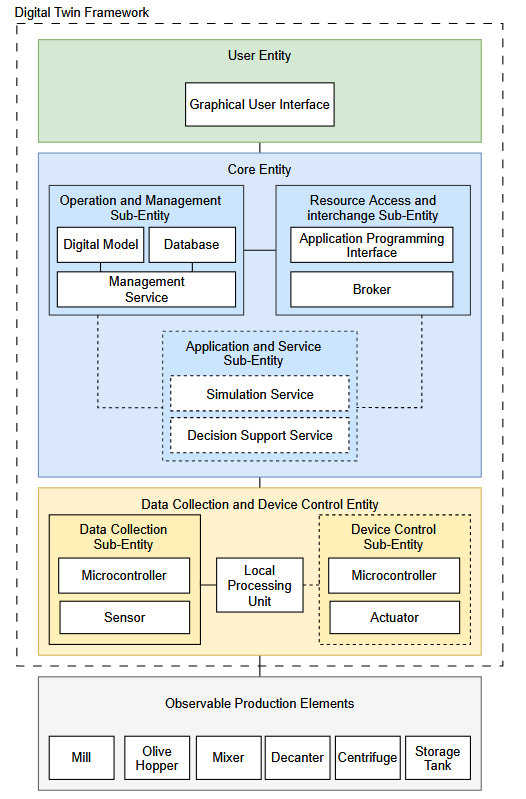

# Digital Twin Framework Architecture

This document provides a detailed breakdown of the **Olive Oil Digital Twin** system architecture, based on the framework diagram shown below.

The system is structured as a layered digital twin framework, separating the physical production layer, edge collection/control, core twin logic, and user interface.

---

## 1. User Entity
The **User Entity** is the top layer, providing human-in-the-loop interaction with the digital twin system.

*   **Graphical User Interface (GUI)**:
    A responsive web dashboard that interfaces with the **Core Entity's API**. It displays real-time telemetry, historical trends, anomaly indicators (e.g., Isolation Forest warnings), and EVOO compliance reports for the production run.

---

## 2. Core Entity
The **Core Entity** represents the brain of the digital twin, orchestrating state synchronization, historical logging, and intelligence.

### A. Operation and Management Sub-Entity
Handles the metadata, schema definitions, and lifecycle management of the twins.
*   **Digital Model**: Defining device properties, features, and capabilities in a JSON schema (stored in the `models/` directory).
*   **Database**: Maintains structural states and metadata for twin models.
*   **Management Service**: Provided by **Eclipse Ditto**, this service handles authentication, twin state synchronization, search indexing, and feature updates.

### B. Resource Access and Interchange Sub-Entity
Manages communications and security.
*   **Application Programming Interface (API)**:
    A **Flask REST API** that acts as the entry point for frontend apps, exposing endpoints for querying sensor history (`GET /data`), health checks (`GET /health`), and analytics/anomaly diagnostics (`GET /ml/anomaly`).
*   **Broker**:
    An **MQTT Message Broker (Eclipse Mosquitto)** running on port `1884`. It acts as the event broker for all inbound sensor messages and outbound twin updates.

### C. Application and Service Sub-Entity
Runs background services that consume twin data to perform simulation and inference.
*   **Simulation Service**: Simulates physical characteristics of the production lines under different conditions.
*   **Decision Support Service**: Runs machine learning pipelines (such as CatBoost, XGBoost, and Random Forest) to predict olive oil quality parameters (free acidity, yield percentage, sensory profiles) and detect outliers.

---

## 3. Data Collection and Device Control Entity
This entity bridges the digital core with the physical shop-floor elements, executing edge telemetry acquisition and remote actuator management.

*   **Data Collection Sub-Entity**:
    *   **Sensors**: Physical sensors monitoring variables like temperature (malaxation temperature), humidity, and chemical markers.
    *   **Microcontrollers**: Edge devices (e.g., ESP32) that sample sensor readings and prepare telemetry payloads.
*   **Local Processing Unit**:
    An edge gateway (e.g., Raspberry Pi or local industrial PC) that routes messages, handles temporary network disconnection buffers, and communicates with the MQTT Broker.
*   **Device Control Sub-Entity**:
    *   **Microcontrollers**: Receive command payloads from Ditto connections via MQTT.
    *   **Actuators**: Relays and motors that perform physical adjustments (e.g., regulating water-to-paste ratios or modifying malaxation heating elements).

---

## 4. Observable Production Elements
These are the actual, physical machinery assets located on the production floor where olive oil is extracted:

*   **Mill**: Crushes raw olives into paste.
*   **Olive Hopper**: Ingests olives and regulates feed rates into the mill.
*   **Mixer (Malaxator)**: Mixes the olive paste to coalesce oil droplets. Accurate temperature and time control during this stage is critical for EVOO compliance.
*   **Decanter**: Separates the oil, pomace, and wastewater using centrifugal force.
*   **Centrifuge**: Purifies the oil by removing any remaining micro-particles of water and solid impurities.
*   **Storage Tank (Deposit)**: Holds the final olive oil under stable temperature and humidity conditions.
