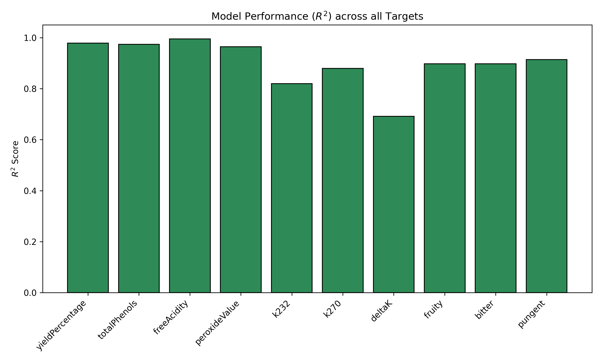
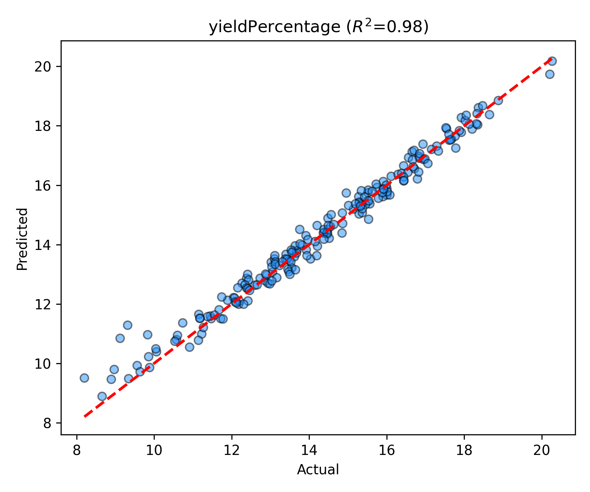
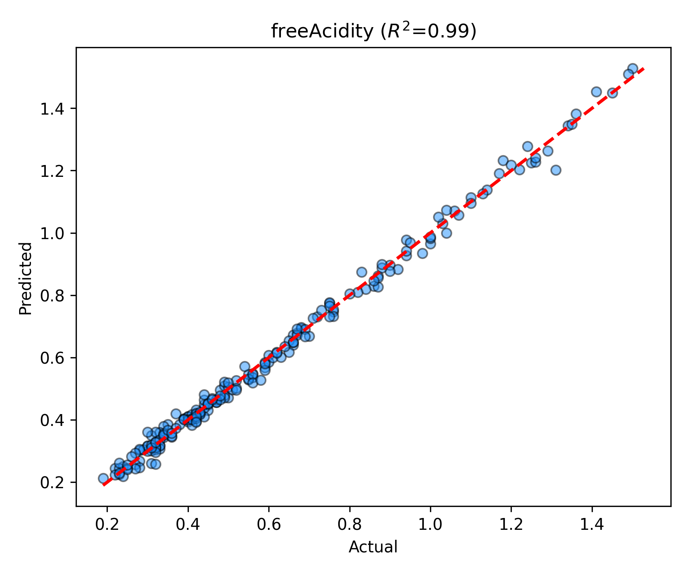
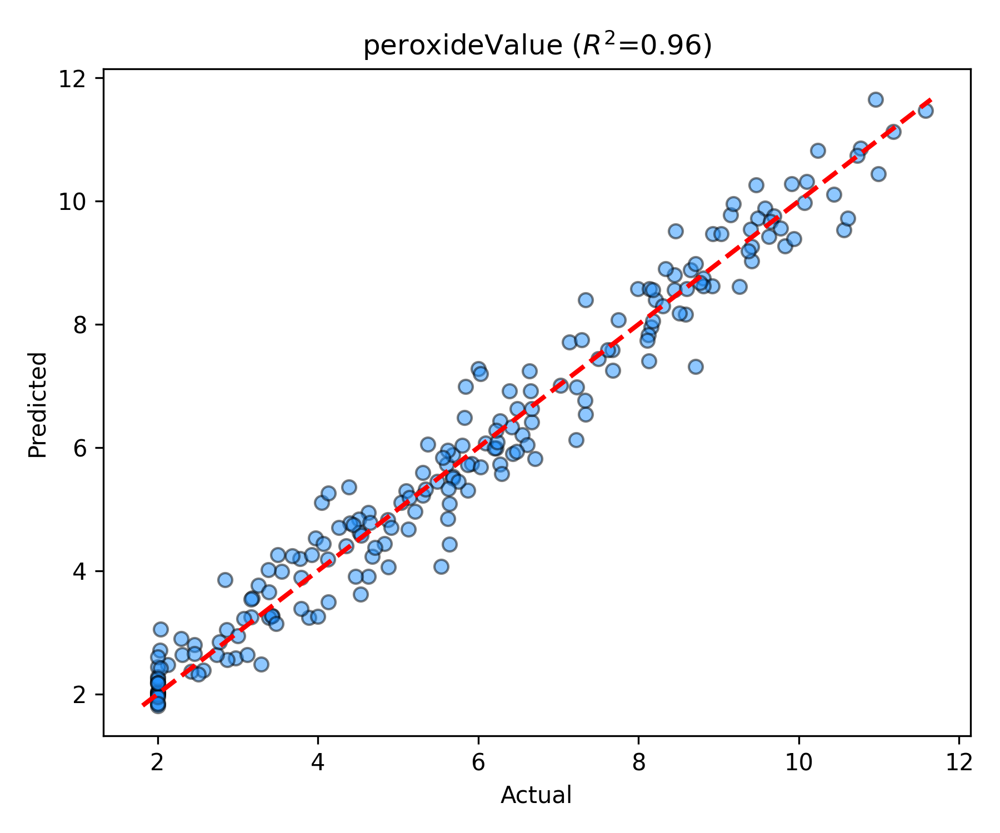

# Machine Learning Integration

This document details the Machine Learning pipeline integrated into the **Olive Oil Digital Twin** system. It explains the model selection methodology, benchmarks three candidate algorithms, and outlines the automated training and inference architecture.

---

## 1. Machine Learning Model Selection
To predict quality indices and process yield based on raw sensor telemetry and agricultural parameters, the problem is formulated as a **nonlinear multi-target regression task**. 

The model takes **9 input features**:
*   `maturationIndex` (olive ripeness)
*   `moistureContent`
*   `oilContent`
*   `defectIndex`
*   `cultivar` (olive variety, categorical)
*   `malaxationTemperature`
*   `malaxationTime`
*   `waterFlowRate`
*   `waterToPasteRatio`

And predicts **10 continuous targets**:
*   `yieldPercentage`
*   `totalPhenols`
*   `freeAcidity`
*   `peroxideValue`
*   `k232`
*   `k270`
*   `deltaK`
*   `fruity`
*   `bitter`
*   `pungent`

### Why CatBoost?
Gradient-boosted decision trees are particularly suited for tabular industrial datasets. Among these, **CatBoost** is selected as the primary estimator due to:
1.  **Native Categorical Feature Support**: The input space includes `cultivar` (categorical). While traditional algorithms require explicit preprocessing like One-Hot Encoding (OHE) which increases dimensionality and memory footprints, CatBoost natively computes dynamic target statistics during tree construction.
2.  **Ordered Boosting Strategy**: Employs permutation-driven boosting to minimize prediction shifts caused by target leakage, yielding superior generalization.
3.  **Algorithmic Robustness**: Requires less parameter tuning compared to deep neural networks, which generally need much larger datasets to achieve stable performance on tabular structures.

---

## 2. Empirical Comparison of Alternative Models
To validate the choice of CatBoost, three tree-based ensemble models were trained under identical conditions using an 80% train / 20% test split on a synthetic dataset of 1,000 batches:

### A. Random Forest Regressor
*   **Preprocessing**: Categorical features were one-hot encoded using Pandas (`get_dummies`).
*   **Structure**: Scikit-learn's `MultiOutputRegressor` wrapped around a `RandomForestRegressor` (100 estimators, max depth of 10).
*   **Average $R^2$**: `0.8862`
*   **EVOO Accuracy**: `79.00%`

### B. XGBoost Regressor
*   **Preprocessing**: Cast the `cultivar` column to category and enabled native categorical support (`enable_categorical=True`).
*   **Structure**: `MultiOutputRegressor` wrapping an `XGBRegressor` (200 estimators, learning rate of 0.05, max depth of 6).
*   **Average $R^2$**: `0.8861`
*   **EVOO Accuracy**: `79.00%`

### C. CatBoost Regressor
*   **Preprocessing**: Cast the `cultivar` column to string and referenced its index in the `cat_features` argument.
*   **Structure**: `MultiOutputRegressor` wrapping a `CatBoostRegressor` (500 iterations, learning rate of 0.05, depth of 6).
*   **Average $R^2$**: `0.8862` (Comparable to other ensembles but with significantly simpler preprocessing and lower memory footprint).
*   **EVOO Accuracy**: `79.00%`

### Performance Summary Table

| Model | Average $R^2$ | EVOO Compliance Accuracy | Native Categorical Support |
| :--- | :---: | :---: | :---: |
| **CatBoost** | **0.8862** | **79.00%** | **Yes (Native string/index)** |
| **Random Forest** | 0.8862 | 79.00% | No (Requires One-Hot Encoding) |
| **XGBoost** | 0.8861 | 79.00% | Partial (Requires category cast) |

---

## 3. Environment Configuration & Pipeline

### Dependencies
The Python environment requirements for machine learning are defined in `ml/requirements-ml.txt`:
*   `catboost` - Main gradient boosting framework.
*   `scikit-learn` - Used for train/test splitting and multi-output orchestration.
*   `pandas` & `numpy` - Data structure and math utilities.
*   `joblib` - Serializing the trained pipeline to a binary `.pkl` file.
*   `matplotlib` - Exporting performance charts.

### Script Architecture (`train_catboost.py`)
The training script coordinates the following steps:
1.  **Data Ingestion**: Loads the dataset, isolates the 9 features from the 10 target variables, and sets `cultivar` to string format.
2.  **Regression Architecture**: Fits a dedicated regressor for each of the 10 continuous targets using `MultiOutputRegressor`.
3.  **Deterministic EVOO Compliance**: Rather than predicting EVOO compliance as a classification task, a post-processing function evaluates the predicted continuous targets against **International Olive Council (IOC)** regulatory thresholds:
    $$\text{EVOO Compliant} = \begin{cases} 
    \text{True} & \text{if } \text{freeAcidity} \le 0.8 \\ 
    & \text{and } \text{peroxideValue} \le 20.0 \\ 
    & \text{and } \text{k232} \le 2.50 \\ 
    & \text{and } \text{k270} \le 0.22 \\ 
    & \text{and } \text{deltaK} \le 0.01 \\ 
    & \text{and } \text{fruity} > 0.0 \\
    \text{False} & \text{otherwise}
    \end{cases}$$
4.  **Performance Exports**: Exports coefficient of determination ($R^2$) bar charts (`r2_scores.png`) and individual target actual-vs-predicted scatter plots to `ml/images/` to visually evaluate accuracy.

---

## 4. Visualizations
The model training outputs the following evaluation metrics:

### Target $R^2$ Scores
A summary of the model coefficients of determination ($R^2$) across all predicted targets:



### Model Predictions Examples
Scatter plots comparing predicted values vs. physical ground truth:

```carousel

<!-- slide -->

<!-- slide -->

```
